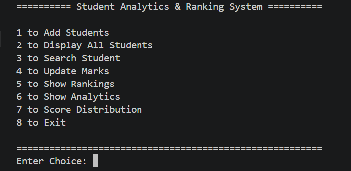
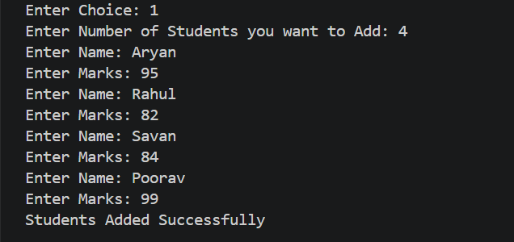
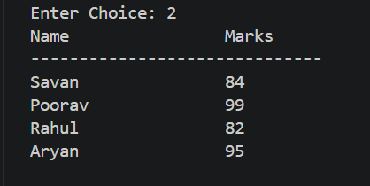
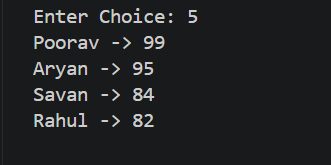
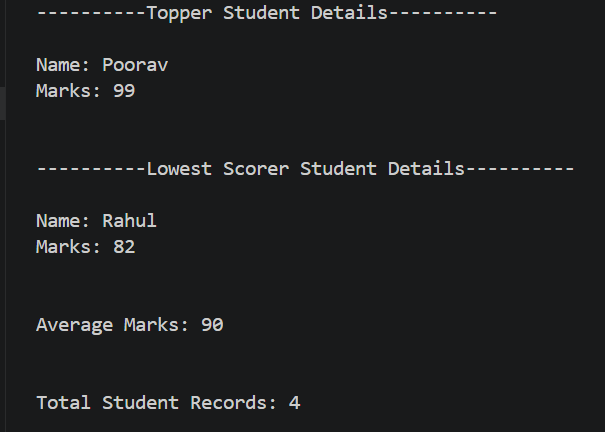
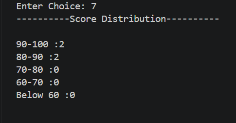

# 📊 Student Analytics & Ranking System

A console-based **Student Analytics & Ranking System** built in **C++** using **Object-Oriented Programming (OOP)** and the **Standard Template Library (STL)**.

This project demonstrates how STL containers and algorithms can be used to efficiently manage student records, generate rankings, perform analytics, and process data in a modular console application.

---

## ✨ Features

- ➕ Add new student records
- 🔍 Search students by name (case-insensitive)
- ✏️ Update student marks
- 📋 Display all student records
- 🏆 Generate rankings using custom sorting
- 📈 View student analytics
- 📊 Display score distribution
- ✅ Prevent duplicate student entries through name normalization

---

## 🛠 Technologies Used

- C++
- Object-Oriented Programming (OOP)
- Standard Template Library (STL)

---

## 📚 Concepts Demonstrated

### Object-Oriented Programming
- Classes & Objects
- Constructors
- Encapsulation
- Getter Functions

### STL
- `unordered_map`
- `vector`
- `sort()`
- Custom Comparator

### Programming Concepts
- Data Normalization
- Case-Insensitive Searching
- Custom Sorting
- Frequency Analysis
- Input Validation
- Modular Programming

---

## 🏆 Ranking Rules

Students are ranked using the following priority:

1. Higher marks
2. Shorter name length
3. Alphabetical order

---

## 📈 Analytics

The application provides:

- 🥇 Top Scorer
- 📉 Lowest Scorer
- 📊 Average Marks
- 👥 Total Student Records
- 📈 Score Distribution

---

## ⚡ Time Complexity

| Operation | Complexity |
|-----------|------------|
| Add Student | O(1) average |
| Search Student | O(1) average |
| Update Marks | O(1) average |
| Display Students | O(n) |
| Generate Rankings | O(n log n) |
| Analytics | O(n) |
| Score Distribution | O(n) |

---

## 📂 Project Structure

```text
Student-Analytics-Ranking-System/
│
├── main.cpp
├── student_analytics.cpp
├── student_analytics.hpp
│
├── README.md
├── LICENSE
├── .gitignore
│
└── screenshots/
    ├── main_menu.png
    ├── add_students.png
    ├── display_students.png
    ├── rankings.png
    ├── analytics.png
    └── score_distribution.png
```

---

## 📸 Screenshots

### Main Menu


### Add Students


### Display Students


### Rankings


### Analytics


### Score Distribution


---

## ▶️ Building & Running

Compile the project using **g++**:

```bash
g++ main.cpp student_analytics.cpp -o StudentAnalytics
```

Run the executable:

### Windows

```bash
StudentAnalytics.exe
```

### Linux/macOS

```bash
./StudentAnalytics
```

---

## 🎯 Learning Outcomes

This project strengthened my understanding of:

- Object-Oriented Programming
- STL Containers
- Custom Comparators
- Sorting Algorithms
- Data Processing
- Data Normalization
- Console Application Development
- Modular Programming
- Input Validation

---

## 🚀 Future Improvements

- Store student records in files (persistent storage)
- Assign unique Student IDs
- Export reports to CSV
- Improve console formatting
- Handle invalid input types more robustly
- Develop a graphical user interface (GUI)

---

## 📄 License

This project is licensed under the **MIT License**.

See the **LICENSE** file for more information.

---

## 👨‍💻 Author

**Aryan**

GitHub: https://github.com/Aryan544-arch/student-analytics-ranking-system